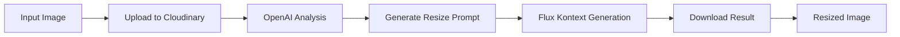

# 🖼️ Image Resizing Tool

An AI-powered image resizing tool that intelligently adapts marketing banners and promotional graphics to different aspect ratios while preserving all visual elements and maintaining professional quality.

## 🌟 Features

- **Smart Aspect Ratio Conversion**: Convert images to 9 different aspect ratios
- **Content Preservation**: Maintains all text, logos, and visual elements
- **AI-Powered Layout Optimization**: Uses OpenAI GPT-4o for intelligent repositioning
- **High-Quality Generation**: Powered by Flux Kontext Dev for professional results
- **Multiple Quality Settings**: Choose between standard, high, and ultra quality
- **Cloud Integration**: Seamless integration with Cloudinary and monitoring with Langfuse

## 🔄 How It Works



### Pipeline Steps

1. **Input Validation** - Validates image file and target aspect ratio
2. **Image Upload** - Uploads to Cloudinary for URL access
3. **AI Analysis** - OpenAI GPT-4o analyzes the image and generates optimization strategy
4. **Prompt Generation** - Creates detailed prompt for image generation model
5. **Image Generation** - Flux Kontext Dev generates the resized image
6. **Output Processing** - Downloads and returns the final result

## 📐 Supported Aspect Ratios

| Ratio  | Use Case                                    |
| ------ | ------------------------------------------- |
| `16:9` | Widescreen (YouTube, presentations)         |
| `9:16` | Portrait/Mobile (Instagram Stories, TikTok) |
| `1:1`  | Square (Instagram posts, profile images)    |
| `4:3`  | Traditional (older displays, print)         |
| `3:4`  | Portrait (print materials, posters)         |
| `4:5`  | Instagram Portrait                          |
| `5:4`  | Large format print                          |
| `21:9` | Ultra-wide (cinematic, headers)             |
| `9:21` | Ultra-tall (mobile banners)                 |

## ⚡ Quality Settings

| Setting    | Steps | Guidance Scale | Description                        |
| ---------- | ----- | -------------- | ---------------------------------- |
| `standard` | 25    | 3.5            | Faster processing, good quality    |
| `high`     | 35    | 4.0            | Balanced quality and speed         |
| `ultra`    | 50    | 4.5            | Maximum quality, slower processing |

## 🚀 Quick Start

### Prerequisites

1. **API Keys Required:**

   ```env
   OPENAI_API_KEY=your_openai_api_key
   REPLICATE_API_TOKEN=your_replicate_token
   ```

2. **Cloudinary Configuration:**

   ```env
   NEXT_PUBLIC_CLOUDINARY_CLOUD_NAME=your_cloud_name
   CLOUDINARY_API_KEY=your_api_key
   CLOUDINARY_API_SECRET=your_api_secret
   ```

3. **Optional - Langfuse Tracking:**
   ```env
   LANGFUSE_SECRET_KEY=your_langfuse_secret
   LANGFUSE_PUBLIC_KEY=your_langfuse_public
   ```

### Installation

1. **Clone and Setup:**

   ```bash
   git clone <repository>
   cd resizing-replicate
   ```

2. **Build with Cog:**

   ```bash
   cog build -t image-resizer
   ```

3. **Run Locally:**
   ```bash
   cog predict -i input_image=@path/to/image.jpg -i aspect_ratio="16:9" -i quality="high"
   ```

### Deploy to Replicate

1. **Push to Replicate:**

   ```bash
   cog push r8.im/your-username/image-resizer
   ```

2. **Use via API:**

   ```python
   import replicate

   output = replicate.run(
       "your-username/image-resizer",
       input={
           "input_image": "https://example.com/image.jpg",
           "aspect_ratio": "16:9",
           "quality": "high"
       }
   )
   ```

## 🔧 API Reference

### Input Parameters

| Parameter      | Type     | Required | Default  | Description                         |
| -------------- | -------- | -------- | -------- | ----------------------------------- |
| `input_image`  | Path/URL | ✅       | -        | Source image to resize              |
| `aspect_ratio` | String   | ✅       | `"16:9"` | Target aspect ratio                 |
| `quality`      | String   | ❌       | `"high"` | Quality level (standard/high/ultra) |

### Output

Returns a `Path` object pointing to the resized image file.

## 🛡️ Error Handling

The tool includes comprehensive error handling:

- **Input Validation**: Checks for valid image files and aspect ratios
- **API Fallbacks**: Fallback prompts if OpenAI analysis fails
- **Network Resilience**: Timeout handling and retry logic
- **Graceful Degradation**: Returns original image if processing fails

## 📊 Monitoring & Tracking

When Langfuse is configured, the tool automatically tracks:

- **Processing Time**: Duration of each pipeline step
- **API Usage**: OpenAI and Replicate API calls
- **Success Rates**: Pipeline success/failure metrics
- **Quality Metrics**: Output quality assessments

## 🎯 Use Cases

### Marketing & Advertising

- **Social Media Adaptation**: Convert banners for different platforms
- **Campaign Assets**: Create variations for multiple channels
- **Brand Consistency**: Maintain visual identity across formats

### E-commerce

- **Product Banners**: Adapt for different marketplace requirements
- **Promotional Graphics**: Resize sale banners for various placements
- **Category Headers**: Create consistent category imagery

### Content Creation

- **Blog Headers**: Resize graphics for different blog layouts
- **Newsletter Graphics**: Adapt visuals for email campaigns
- **Presentation Assets**: Convert graphics for slides

## 🔬 Technical Details

### AI Models Used

1. **OpenAI GPT-4o Vision**

   - Analyzes image content and layout
   - Generates optimization strategies
   - Creates detailed prompts for image generation

2. **Flux Kontext Dev**
   - High-quality image-to-image generation
   - Maintains visual consistency
   - Supports precise aspect ratio control

### Architecture

- **Framework**: Cog (for containerization and deployment)
- **Language**: Python 3.11
- **Key Libraries**: OpenAI, Replicate, Cloudinary, Pydantic
- **Storage**: Cloudinary for image hosting
- **Monitoring**: Langfuse for tracking and analytics

## 🤝 Contributing

1. Fork the repository
2. Create a feature branch
3. Make your changes
4. Add tests
5. Submit a pull request

## 📄 License

This project is licensed under the MIT License - see the [LICENSE](LICENSE) file for details.

## 🆘 Support

For issues and questions:

1. Check the [troubleshooting guide](docs/data.md#troubleshooting)
2. Review [common issues](#common-issues)
3. Open an issue on GitHub
4. Contact support

### Common Issues

**Q: "OpenAI API rate limit exceeded"**
A: Implement retry logic with exponential backoff. Consider upgrading your OpenAI plan.

**Q: "Flux generation taking too long"**
A: Try using "standard" quality setting for faster processing.

**Q: "Cloudinary upload failed"**
A: Check your API credentials and ensure sufficient storage quota.

## 🔮 Roadmap

- [ ] **Batch Processing**: Support for multiple images
- [ ] **Custom Styles**: User-defined style templates
- [ ] **Format Support**: Additional output formats (PNG, WebP)
- [ ] **Background Removal**: Option to remove/replace backgrounds
- [ ] **Text Enhancement**: Automatic text optimization for new layouts

---

**Built with ❤️ using AI-powered image processing**
# resizing-image
